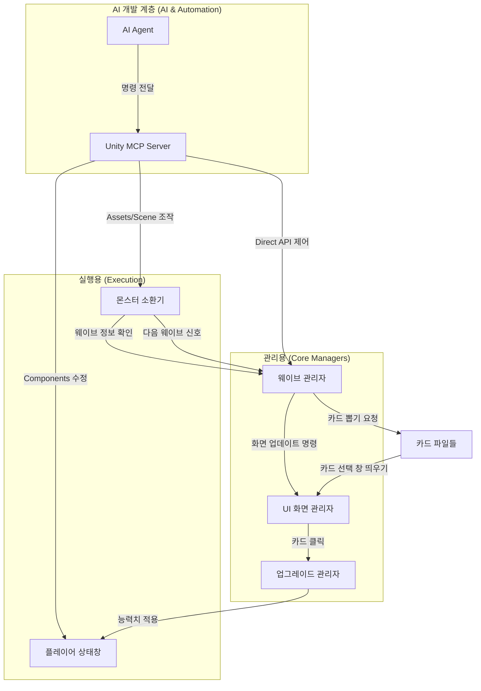

# 🏗️ PJ_1 프로젝트 전체 설계도 및 기능 설명서 (Architecture)

이 문서는 이 프로젝트가 어떻게 구성되어 있고, 기능들이 어떻게 연결되는지 한눈에 볼 수 있는 **전체 구조 설명서**입니다.

## 1. 개요 (무엇을 만들고 있나요?)
`PJ_1`은 **ScriptableObject(SO)**와 **싱글톤(Singleton)** 관리 시스템을 사용합니다. 데이터를 파일로 관리하고 한 곳에서 통제하는 구조로, 나중에 게임 내용을 추가하거나 수정하기 매우 쉽습니다.

## 2. 주요 기능 (기능별 설명)

### 2.1 플레이어 (Player)
- **능력치 관리(PlayerStat)**: 기본 체력, 공격력, 어떤 무기를 끼고 있는지 등을 관리합니다.
- **공격 및 디버프(PlayerAttack)**: 마우스 방향으로 무기를 회전시키며, 과도한 회전(3600도) 시 **'어지러움' 디버프**가 발동되어 5초간 조작이 제한됩니다.
- **체력 창(PlayerHealth)**: 유니티 화면 위에서 플레이어의 현재 체력을 실시간으로 보여줍니다.

### 2.2 몬스터와 웨이브 (Monster & Wave)
- **몬스터 정보(MonsterData)**: 무엇을 소환할지, 공격력과 체력 수치는 얼마인지 데이터를 들고 있습니다.
- **웨이브 관리(WaveManager)**: 현재 몇 단계인지, 다음 단계로 넘어갈지 등을 총괄합니다.
- **몬스터 소환(MonsterSpawn)**: 웨이브 정보에 따라 정해진 몬스터를 화면에 소환하고 능력치를 설정해 줍니다.

### 2.3 업그레이드 카드 (Gacha Card)
- **카드 관리(CardManager)**: 어떤 업그레이드 카드들이 있는지, 나올 확률은 얼마인지 관리합니다.
- **업그레이드 적용(UpgradeManager)**: 플레이어가 고른 카드의 효과를 실제 플레이어의 능력치에 반영해 줍니다.
- **확장성**: 새로운 기능의 카드를 만들 때 기존 코드를 건드리지 않고 새로 추가만 하면 되도록 설계되었습니다.

### 2.4 AI 연동 및 에디터 자동화 (Unity MCP)
- **Unity MCP (Model Context Protocol)**: AI 에이전트(Antigravity)가 Unity 에디터와 직접 소통하기 위한 고속 데이터 통로(Bridge)입니다.
- **On-demand 데이터 쿼리**: 모든 데이터를 읽는 대신, AI가 필요한 정보(예: 특정 오브젝트 상태)만 실시간으로 요청하여 분석하므로 토큰 사용이 효율적이고 정확합니다.
- **실시간 제어**: AI가 에디터 내부의 GameObject 검색, 수정, 삭제, 컴포넌트 밸런싱 등을 직접 수행하여 개발 생산성을 극대화합니다.

## 3. 프로그램 간의 상호작용 (어떻게 서로 부르나요?)

## 4. 데이터 계층 구조 (데이터가 들어있는 순서)

1. **웨이브 전체**: `전체 웨이브 파일` → `웨이브 개별 정보` → `소환할 몬스터 구성` → `몬스터 상세 데이터`
2. **몬스터 상세**: `몬스터 기본 정보` → (`공격력/방어력 데이터`, `능력치 데이터`)
3. **업그레이드**: `카드 관리 파일` → `강화 카드 파일` (능력치 강화 혹은 특수 효과 등)

## 5. 앞으로 완성해야 할 부분 (발전 방향)
- **능력치 시스템 고도화**: 단순히 더하는 방식에서 복합적인 수식으로 계산되게 발전시킬 수 있습니다.
- **공통 풀링 시스템**: 무기 효과나 몬스터 소환 시마다 만들어내는 것 대신, 쓰고 다시 가져오는 방식으로 바꾸는 게 좋습니다.
