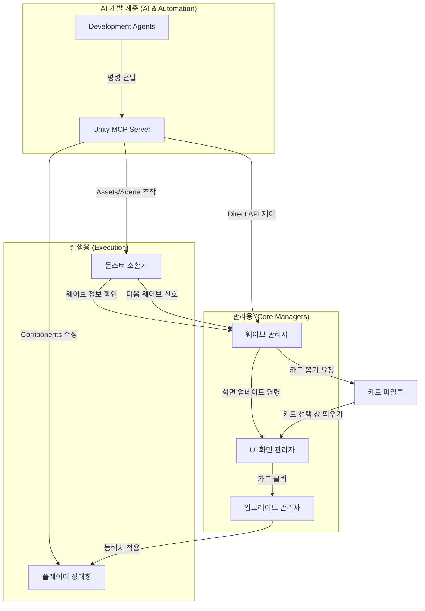

# 🏗️ PJ_1 프로젝트 전체 설계도 (Architecture)

이 문서는 프로젝트의 기술적 구성과 시스템 간 연동 방식을 정의한 **기술 설계서**입니다.

## 1. 개요 (Technical Overview)
`PJ_1`은 **ScriptableObject(SO)**와 **싱글톤(Singleton)** 관리 시스템을 사용합니다.
상세한 게임 기획 및 기믹 설명은 [Directives/Planning/proposal.md](../Planning/proposal.md)을 참고해 주세요.

---

## 2. 기술 아키텍처 계층 (Technical Layers)

1.  **데이터 계층 (Data Layer)**: 모든 밸런싱 데이터는 `ScriptableObject`에 저장 (Assets/Data/...)
2.  **논리 계층 (Logic Layer)**: 싱글톤 매니저 패턴을 활용하여 시스템(Wave, Monster, Card) 간의 독립성 유지.
3.  **UI 계층 (UI Layer)**: UI Toolkit(USS/UXML)을 활용하여 로직과 스타일을 분리.

---

## 3. 프로그램 간의 상호작용 (System Interaction)

---

## 4. 데이터 계층 구조 (Data Hierarchy)

1. **웨이브 전체**: `전체 웨이브 파일` → `웨이브 개별 정보` → `소환할 몬스터 구성` → `몬스터 상세 데이터`
2. **몬스터 상세**: `몬스터 기본 정보` → (`공격/방어력 데이터`, `능력치 데이터`)
3. **업그레이드**: `카드 관리 파일` → `강화 카드 파일` (능력치 강화 혹은 특수 효과 등)

---

## 5. 멀티 에이전트 협업 규칙 (Multi-Agent Rules)
여러 AI 에이전트(Antigravity, Claude 등)가 이 프로젝트를 수정할 때 지켜야 할 원칙입니다.

- **문서 동기화**: 작업 완료 후 기획 내용은 `proposal.md`, 기술 설계는 `architecture.md`를 최신 상태로 업데이트합니다.
- **작업 기록**: 주요 기능 변경 시 `SESSION_LOG.md` 또는 커밋 메시지에 상세 내용을 기록합니다.
- **규칙 준수**: `Directives/Agent/agent-rules.md`에 정의된 페르소나와 작업 방식을 일관되게 적용합니다.
