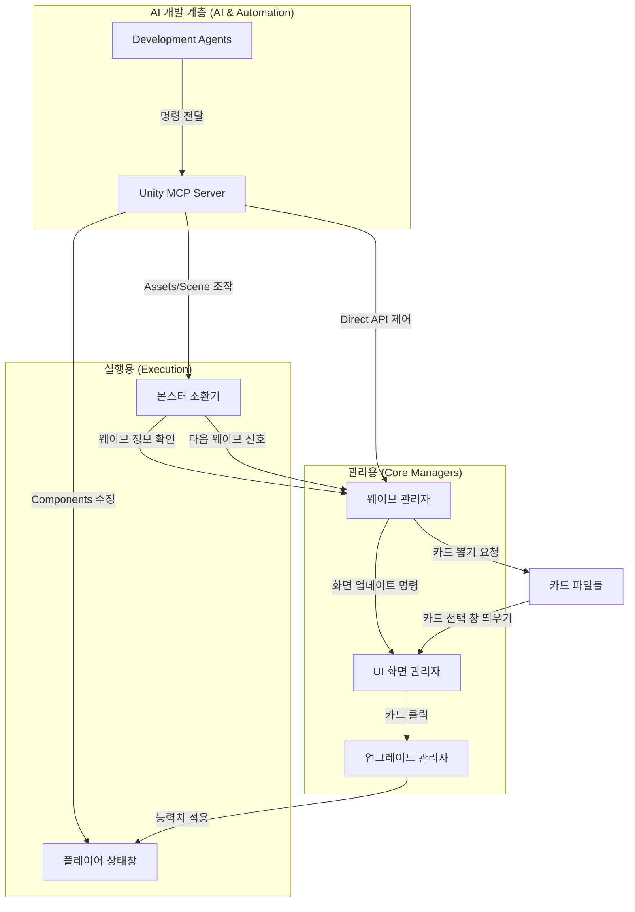

# 🏗️ PJ_1 프로젝트 전체 설계도 (Architecture)

이 문서는 프로젝트의 기술적 구성과 시스템 간 연동 방식을 정의한 **기술 설계서**이자, 모든 기획/코드 문서를 연결하는 **허브(Hub)** 역할을 합니다.

## 1. 개요 (Technical Overview)
`PJ_1`은 **ScriptableObject(SO)**와 **싱글톤(Singleton)** 관리 시스템을 사용합니다.

### 📂 관련 문서 목록 (Document Map)
| 문서 | 경로 | 역할 |
| :--- | :--- | :--- |
| **문서 전체 맵** | [document-map.md](./document-map.md) | **[중앙 허브]** 모든 문서의 역할 및 업데이트 주기 관리 |
| **기획서 (Proposal)** | [proposal.md](../Planning/proposal.md) | 게임 비전, 핵심 루프, 기믹 정의 |

| **콘텐츠 상세 명세** | [content_spec.md](../Planning/content_spec.md) | 무기/병사 데이터 구조 및 종류 상세 정의 |
| **에이전트 규칙** | [agent-rules.md](../Agent/agent-rules.md) | AI 협업 페르소나 및 운영 원칙 |
| **코딩 컨벤션** | [coding-conventions.md](../Guidelines/coding-conventions.md) | 네이밍, 최적화, 구조 규칙 |
| **성능 지침** | [performance.md](../Guidelines/performance.md) | SO 활용, 메모리, 오브젝트 풀링 |
| **시작 가이드** | [getting-started.md](../GettingStarted/getting-started.md) | 초보자용 문서 읽기 순서 |

---

## 2. 기술 아키텍처 계층 (Technical Layers)

1.  **데이터 계층 (Data Layer)**: 모든 밸런싱 데이터는 `ScriptableObject`에 저장 (`Assets/ScriptableObjects/...`)
2.  **논리 계층 (Logic Layer)**: 싱글톤 매니저 패턴을 활용하여 시스템(Wave, Monster, Card) 간의 독립성 유지.
3.  **UI 계층 (UI Layer)**: UI Toolkit(USS/UXML)을 활용하여 로직과 스타일을 분리.

---

## 3. 코드 ↔ 기획 매핑 테이블 (Code-Spec Mapping)

아래 테이블은 **실제 스크립트 파일**과 **기획 문서의 해당 섹션**을 직접 매핑합니다.
AI 에이전트는 새 기능 구현 전 이 테이블을 참조하여 기존 구현을 먼저 파악해야 합니다.

### 3.1 ScriptableObject 데이터 클래스
모든 밸런싱 데이터는 `ScriptableObject`를 통해 관리됩니다. 자세한 필드 정의와 구조는 **[세부 데이터 구조 문서](./data-structures.md)**를 참고하세요.

| 스크립트 경로 | 클래스명 | 기획 문서 참조 | 설명 |
| :--- | :--- | :--- | :--- |
| `Assets/ScriptableObjects/Item/Scripts/ItemData.cs` | `ItemData` (abstract) | — | 모든 아이템의 기본 클래스 (icon, type, description) |
| `Assets/ScriptableObjects/Item/Scripts/EquipmentData.cs` | `EquipmentData` | [content_spec.md §1](../Planning/content_spec.md) | 무기 데이터 (damage, defense, prefab) |
| `Assets/ScriptableObjects/Monster/Scripts/MonsterData.cs` | `MonsterData` | — | 몬스터 최종 정의 데이터 |
| `Assets/ScriptableObjects/Monster/Scripts/MonAttackData.cs` | `MonAttackData` | — | 몬스터 공격 데이터 (damage, speed, range) |
| `Assets/ScriptableObjects/Card/Scripts/CardManager.cs` | `CardManager` | — | 카드 풀 및 획득 확률 제어 |

### 3.2 플레이어 시스템 스크립트
| 스크립트 경로 | 클래스명 | 기획 문서 참조 | 설명 |
| :--- | :--- | :--- | :--- |
| `Assets/Scripts/Player/PlayerStat.cs` | `PlayerStat` (Singleton) | [proposal.md §3.1](../Planning/proposal.md) | HP, 데미지, 장비 관리 |
| `Assets/Scripts/Player/PlayerAttack.cs` | `PlayerAttack` | [proposal.md §2.2](../Planning/proposal.md), [content_spec.md §1](../Planning/content_spec.md) | 마우스 각도 기반 무기 회전, 어지러움 시스템 |
| `Assets/Scripts/Equipment.cs` | `Equipment` | [content_spec.md §1](../Planning/content_spec.md) | 장비 컴포넌트 (EquipmentData 참조) |

---

## 4. 프로그램 간의 상호작용 (System Interaction)

---

## 5. 데이터 계층 구조 (Data Hierarchy)

1. **아이템 계층**: `ItemData` (abstract) → `EquipmentData` (무기/방어구)
2. **웨이브 전체**: `전체 웨이브 파일` → `웨이브 개별 정보` → `소환할 몬스터 구성` → `몬스터 상세 데이터`
3. **몬스터 상세**: `몬스터 기본 정보` → (`공격/방어력 데이터`, `능력치 데이터`)
4. **업그레이드**: `카드 관리 파일` → `강화 카드 파일` (능력치 강화 혹은 특수 효과 등)

---

## 6. 멀티 에이전트 협업 규칙 (Multi-Agent Rules)
여러 AI 에이전트(Antigravity, Claude 등)가 이 프로젝트를 수정할 때 지켜야 할 원칙입니다.

- **문서 동기화**: 작업 완료 후 기획 내용은 `proposal.md`, 기술 설계는 `architecture.md`, 콘텐츠 데이터는 `content_spec.md`를 최신 상태로 업데이트합니다.
- **코드 변경 시 매핑 갱신**: 새로운 스크립트를 추가하거나 기존 SO를 변경하면, §3의 코드↔기획 매핑 테이블을 반드시 업데이트합니다.
- **작업 기록**: 주요 기능 변경 시 `SESSION_LOG.md` 또는 커밋 메시지에 상세 내용을 기록합니다.
- **규칙 준수**: `Directives/Agent/agent-rules.md`에 정의된 페르소나와 작업 방식을 일관되게 적용합니다.
